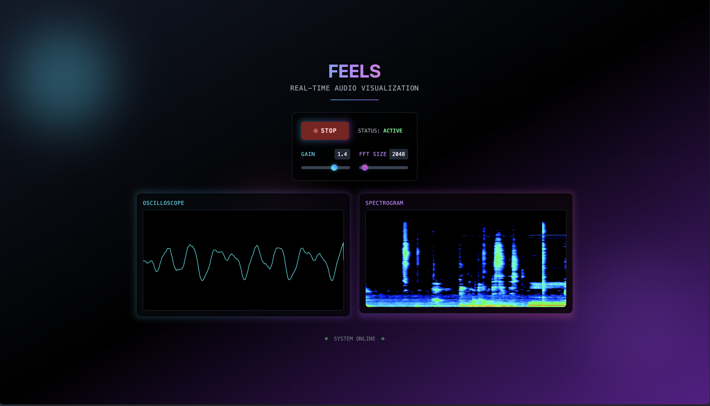

# Feels - Real-Time Audio Visualization

A modern, React-based audio visualization application that provides real-time visual feedback from microphone input with beautiful oscilloscope and spectrogram displays.




## ✨ Features

- **Real-Time Audio Processing**: Captures microphone input using Web Audio API
- **Dual Visualizations**: 
  - **Oscilloscope**: Time-domain waveform visualization
  - **Spectrogram**: Frequency-domain analysis with color-mapped intensity
- **Interactive Controls**: 
  - Start/Stop audio capture
  - Adjustable gain control (0-2x)
  - Variable FFT size (32-32768 samples)
- **Modern UI**: Beautiful gradient effects and responsive design
- **Accessibility**: Full keyboard navigation and screen reader support
- **Error Handling**: Graceful handling of microphone permissions and browser compatibility

## 🚀 Quick Start

### Prerequisites

- Node.js 16+ 
- Modern web browser with microphone access
- npm or yarn package manager

### Installation

1. Clone the repository:
```bash
git clone <repository-url>
cd feels
```

2. Install dependencies:
```bash
npm install
```

3. Start the development server:
```bash
npm run dev
```

4. Open your browser to `http://localhost:3000` (or `http://localhost:3001` if 3000 is in use)

5. **Grant microphone permissions** when prompted to enable audio visualization

## 🎛️ Usage

### Starting Audio Capture
1. Click the **START** button
2. Grant microphone permissions when prompted
3. Watch the real-time visualizations update

### Controls
- **Gain Slider**: Adjust input sensitivity (0-2x multiplier)
- **FFT Size Slider**: Change frequency analysis resolution (32-32768 samples)
- **STOP Button**: Stop audio capture and release microphone

### Status Indicators
- **STANDBY**: Ready to start, microphone not active
- **ACTIVE**: Currently capturing and processing audio
- **Error Messages**: Permission denied or compatibility issues

## 🧪 Testing

The project includes comprehensive test coverage (47/47 tests passing):

```bash
# Run all tests
npm test

# Run tests in watch mode
npm run test:watch

# Run specific test suites
npm test -- --testNamePattern="UserControls"
npm test -- --testNamePattern="Spectrogram"
```

### Test Coverage
- **Component Tests**: UserControls, Spectrogram, Oscilloscope, AudioCapture
- **Integration Tests**: Full app functionality and user interactions
- **Unit Tests**: Audio processing, visualization utilities
- **Accessibility Tests**: ARIA labels, keyboard navigation

## 🏗️ Build & Deployment

### Production Build
```bash
npm run build
```

### Start Production Server
```bash
npm start
```

The build creates an optimized static export ready for deployment to any static hosting service.

## 🛠️ Technology Stack

### Frontend
- **Next.js 14.2.30**: React framework with server-side rendering
- **React 18**: Component-based UI library
- **Tailwind CSS 3**: Utility-first CSS framework
- **Styled JSX**: Component-scoped CSS

### Audio Processing
- **Web Audio API**: Real-time audio capture and analysis
- **MediaDevices API**: Microphone access
- **Canvas API**: High-performance visualization rendering

### Development & Testing
- **Jest 29**: JavaScript testing framework
- **React Testing Library**: Component testing utilities
- **ESLint**: Code linting and style enforcement
- **PostCSS**: CSS processing and optimization

## 🎨 Architecture

### Component Structure
```
src/
├── components/
│   ├── AudioCapture.js     # Audio context provider
│   ├── UserControls.js     # Control panel UI
│   ├── Oscilloscope.js     # Time-domain visualization
│   └── Spectrogram.js      # Frequency-domain visualization
├── lib/
│   ├── audio.js           # Audio utility functions
│   ├── audioHandler.js    # Audio processing logic
│   └── visualizations.js  # Canvas rendering utilities
├── pages/
│   └── index.js           # Main application page
└── styles/
    └── globals.css        # Global styles and Tailwind imports
```

### Key Design Patterns
- **Context API**: Centralized audio state management
- **Custom Hooks**: Reusable audio processing logic
- **Canvas Optimization**: RequestAnimationFrame for smooth rendering
- **Error Boundaries**: Graceful error handling and user feedback

## 🔧 Development

### Local Development
```bash
# Install dependencies
npm install

# Start development server
npm run dev

# Run tests in watch mode
npm test -- --watch

# Run linting
npm run lint
```

### Code Quality
- **ESLint Configuration**: Enforces consistent code style
- **Jest Setup**: Comprehensive mocking for browser APIs
- **Accessibility Testing**: WCAG compliance verification

## 🌐 Browser Support

- **Chrome 66+**: Full support
- **Firefox 60+**: Full support  
- **Safari 11.1+**: Full support
- **Edge 79+**: Full support

**Note**: Requires HTTPS in production for microphone access.

## 🐛 Troubleshooting

### Common Issues

**Microphone Permission Denied**
- Check browser permissions settings
- Ensure HTTPS in production
- Try refreshing and re-granting permissions

**No Audio Visualization**
- Verify microphone is working in other apps
- Check browser console for errors
- Ensure speakers/headphones aren't causing feedback

**Performance Issues**
- Lower FFT size for better performance
- Close other audio applications
- Use Chrome for best performance

## 📝 License

This project is open source and available under the [MIT License](LICENSE).

## 🤝 Contributing

1. Fork the repository
2. Create a feature branch (`git checkout -b feature/amazing-feature`)
3. Commit your changes (`git commit -m 'Add amazing feature'`)
4. Push to the branch (`git push origin feature/amazing-feature`)
5. Open a Pull Request

### Development Guidelines
- Maintain test coverage above 90%
- Follow existing code style and patterns
- Add accessibility considerations for new features
- Update documentation for significant changes

---

**Built with ❤️ using React, Next.js, and the Web Audio API**
